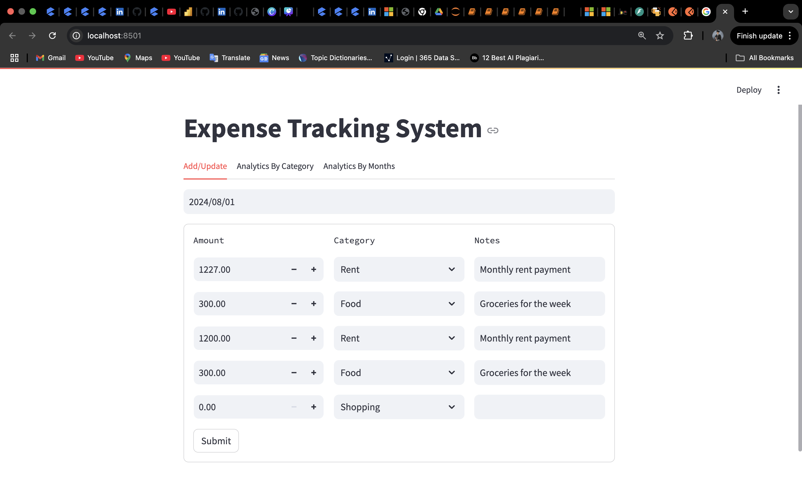
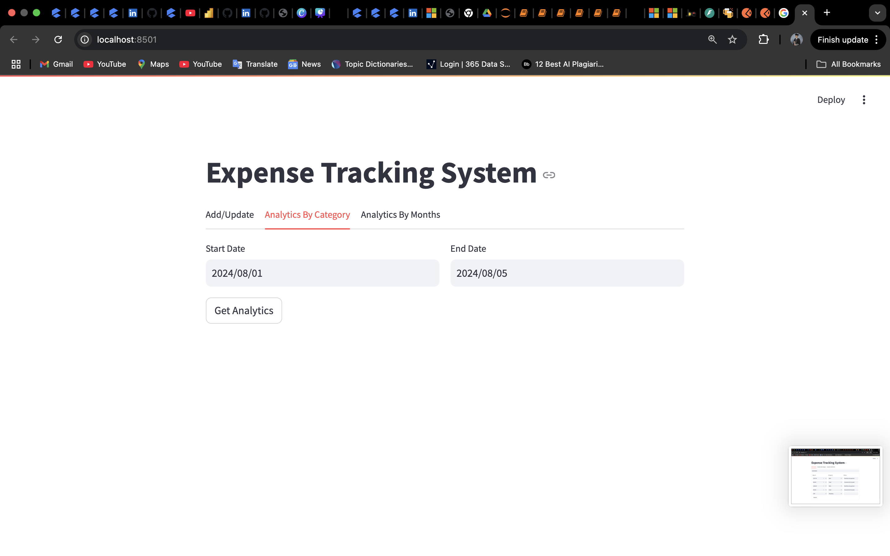
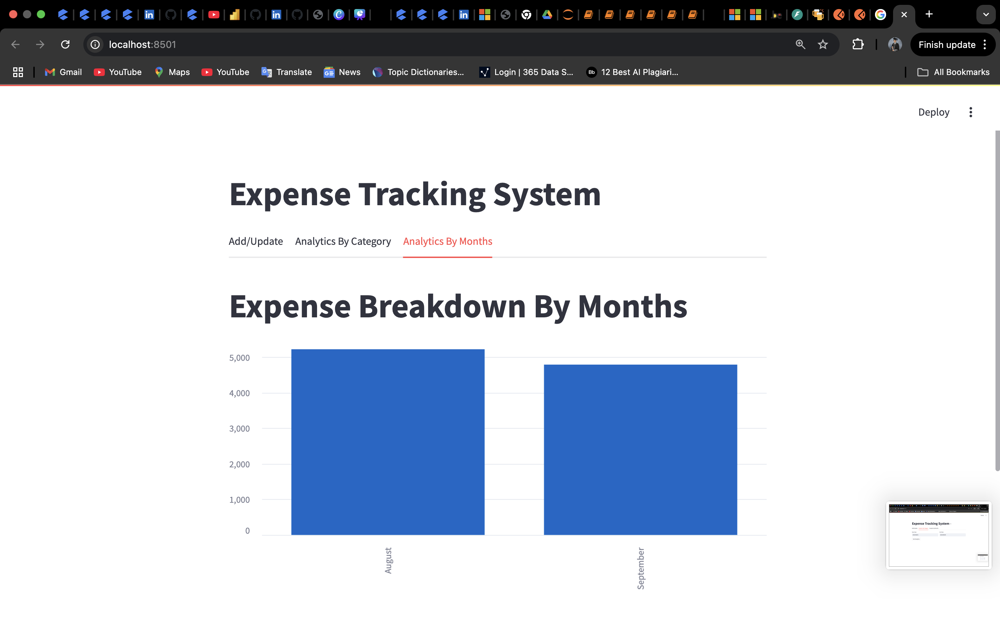

# 💰 Expense Tracking System

A **Expense Tracking & Analytics application** built using **Streamlit**, **FastAPI**, and **MySQL**. The system allows users to record daily expenses, update existing entries, and analyse spending trends by **category** and **month** through interactive dashboards.

This project demonstrates **end‑to‑end application development**, including database design, REST APIs, frontend dashboards, and testing.

---

## Features

### Expense Management

* Add and update daily expenses
* Categorise expenses (Food, Rent, Shopping, Entertainment, etc.)
* Store optional notes for each expense

### Analytics Dashboard

* **Category‑wise analysis** over a custom date range
* **Month‑wise expense trends** using visual charts
* Real‑time insights powered by SQL aggregations

### Backend & Architecture

* REST APIs built with **FastAPI**
* MySQL database for persistent storage
* Centralised logging for debugging and monitoring

### Testing

* Tests are written using **Pytest**
* Tests were executed against the **actual MySQL database**
* Given the **small scope of the project**, this approach was chosen to keep the setup simple and validate real SQL behaviour
* Tests verify CRUD operations, aggregations, and data integrity end-to-end

---

## Tech Stack

| Layer    | Technology |
| -------- | ---------- |
| Frontend | Streamlit  |
| Backend  | FastAPI    |
| Database | MySQL      |
| Testing  | Pytest     |
| Language | Python     |

---

## Project Structure

```
expense_management/
│
├── backend/                     # FastAPI backend & database logic
│   ├── server.py                # REST API definitions
│   ├── db_helper.py             # MySQL queries & DB access
│   ├── logging_setup.py         # Centralised logging configuration
│   └── server.log               # Backend runtime logs
│
├── frontend/                    # Streamlit UI
│   ├── app.py                   # Main Streamlit entry point
│   ├── add_update.py            # Add/update daily expenses
│   ├── analytics_by_category.py # Category-wise analytics
│   └── analytics_by_months.py   # Month-wise analytics
│
├── database/                    # Database schema & seed data
│   └── expense_db_creation.sql  # MySQL database creation script
│
├── tests/                       # Automated tests
│   ├── backend/
│   │   └── test_db_helper.py    # Integration tests using real DB
│   ├── frontend/                # (Reserved for UI tests)
│   └── conftest.py              # Pytest configuration & fixtures
│
├── requirements.txt             # Python dependencies
├── README.md                    # Project documentation
└── .venv/                       # Local virtual environment
```

---

## Database Schema

**Database:** `expense_manager`

**Table:** `expenses`

| Column       | Type     | Description               |
| ------------ | -------- | ------------------------- |
| id           | INT (PK) | Auto‑increment expense ID |
| expense_date | DATE     | Date of expense           |
| amount       | FLOAT    | Expense amount            |
| category     | VARCHAR  | Expense category          |
| notes        | TEXT     | Optional description      |

---

## Running the Project 

>

* Backend runs using **FastAPI**
* Frontend runs using **Streamlit**
* MySQL is used for persistent storage

If you wish to run the project locally:

```bash
pip install -r requirements.txt
uvicorn backend.server:app --reload
streamlit run frontend/app.py
```

* FastAPI: `http://localhost:8000`
* Streamlit UI: `http://localhost:8501`

---

## API Endpoints

| Method | Endpoint         | Description                  |
| ------ | ---------------- | ---------------------------- |
| GET    | /expenses/{date} | Fetch expenses for a date    |
| POST   | /expenses        | Add or update expenses       |
| GET    | /monthly_summary | Monthly & category analytics |

---

## Running Tests

```bash
pytest tests/
```

✔ Tests are executed against the actual MySQL database

---

## Key Learnings

* Designing RESTful APIs with FastAPI
* Integrating Streamlit with backend services
* SQL aggregation and analytics using MySQL
* Writing integration tests for database-driven applications using Pytest
* Applying core Python concepts such as functions, modules, error handling, data structures, and clean code practices
* Structuring a scalable and maintainable Python project

---

## Screenshots

### Add / Update Expenses


### Analytics by Category


### Analytics by Month



